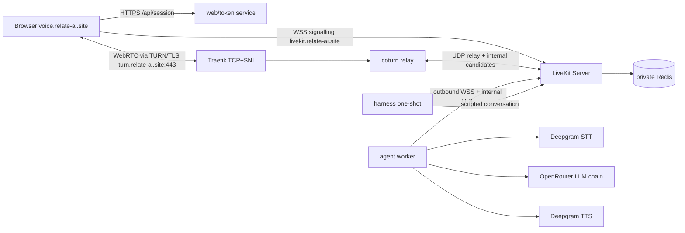

# Architecture

## Topology

One Coolify Docker Compose application, five long-lived containers plus a
one-shot validation service. Two HTTPS routes via Coolify Traefik, one TCP+SNI
route for TURN/TLS. No host-published media ports are required.

## Media Path

External clients cannot reach UDP/TCP media ports (host firewall admits only
22/80/443). All client media flows as TURN/TLS over port 443: Traefik routes
`HostSNI(turn.relate-ai.site)` to coturn; coturn relays to the SFU using the
SFU's advertised internal candidates (`advertise_internal_ip`). In-network
participants (agent, harness) use direct UDP.

## Conversation Path

Microphone audio -> LiveKit -> Deepgram STT (nova-3) -> text -> OpenRouter
free-model chain (poolside/laguna-xs-2.1:free, then z-ai/glm-5.2:free, then
cohere/north-mini-code:free) -> text -> Deepgram TTS (aura-2-asteria-en) ->
LiveKit audio. VAD turn detection with interruption enabled; barge-in yields
agent audio and continues from the interrupting turn.

## Provider Neutrality

`STTProvider`/`TTSProvider`/`LLMProvider` protocols with a registry/factory
(`src/relate_voice/providers/`). Core session assembly (`agent.py`) receives
injected instances and contains no provider branching. Mock providers prove
extension without core edits. The OpenRouter adapter passes the exact ordered
chain; fallback advances only on rate-limit/timeout/transient/unavailable.
