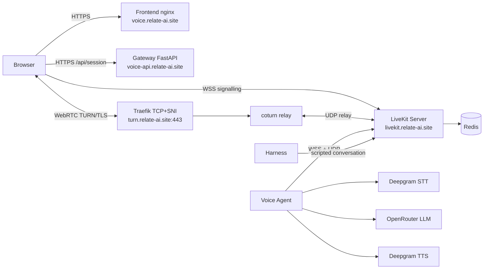

# Architecture

## Overview

Two independent Coolify applications on a single Contabo VPS (`37.60.235.136`):

1. **Relate Voice UI** — static frontend served by nginx
2. **Relate LiveKit Voice** — backend stack (LiveKit, agent, gateway, TURN, Redis)

## Topology



## Service Map

### Frontend (Coolify Web Apps — `ps7z244qvspp3by5sdlcrlc8`)

| Container | Role | Public route |
|---|---|---|
| `voice-ui-*` | nginx serving static SPA + reverse proxy assets | `https://voice.relate-ai.site` |

- Built from `relate-ai/relate-voice-ui` (Dockerfile: multi-stage node build → nginx)
- Calls backend API directly at `voice-api.relate-ai.site` (CORS enabled)
- No secrets, no backend logic, no LiveKit dependency

### Backend (Coolify AI Agents — `xa0mj8kgd9ydkzg89pzdgz13`)

| Service | Role | Public route |
|---|---|---|
| `livekit` | LiveKit Server v1.13.6 (signalling/API) | `https://livekit.relate-ai.site` |
| `redis` | Private state store (AOF persisted) | none |
| `agent` | Python voice worker (Deepgram + OpenRouter) | none |
| `web` | Token/session gateway (FastAPI) | `https://voice-api.relate-ai.site` |
| `api` | Dedicated API service (FastAPI) | internal |
| `coturn` | TURN relay (TLS terminated at Traefik) | `turns:turn.relate-ai.site:443` (TCP+SNI) |
| `harness` | One-shot scripted conversation validation | none (exits after deploy) |

## Media Path

External clients cannot reach UDP/TCP media ports (host firewall admits only
22/80/443). All client media flows as TURN/TLS over port 443: Traefik routes
`HostSNI(turn.relate-ai.site)` to coturn; coturn relays to the SFU using the
SFU's advertised internal candidates (`advertise_internal_ip`). In-network
participants (agent, harness) use direct UDP.

## Conversation Path

```
Microphone audio
  → LiveKit
    → Deepgram STT (nova-3)
      → text
        → OpenRouter free-model chain
          (poolside/laguna-xs-2.1:free → z-ai/glm-5.2:free → cohere/north-mini-code:free)
          → text
            → Deepgram TTS (aura-2-asteria-en)
              → LiveKit audio
                → Browser speaker
```

VAD turn detection with interruption enabled; barge-in yields agent audio
and continues from the interrupting turn.

## Session Flow

1. Browser loads `https://voice.relate-ai.site` (independent frontend)
2. Browser POSTs to `https://voice-api.relate-ai.site/api/session` (CORS)
3. Gateway creates LiveKit token with room join + agent dispatch
4. Browser connects to `wss://livekit.relate-ai.site` with token
5. LiveKit dispatches voice agent to the room
6. Bidirectional audio flows via WebRTC (TURN/TLS for external clients)

## Domain Routing

| Domain | Target | Protocol |
|---|---|---|
| `voice.relate-ai.site` | Frontend (nginx) | HTTPS |
| `voice-api.relate-ai.site` | Backend web service (FastAPI) | HTTPS |
| `livekit.relate-ai.site` | Backend LiveKit server | HTTPS/WSS |
| `turn.relate-ai.site` | Backend coturn (TCP+SNI) | TLS |

## Provider Neutrality

`STTProvider`/`TTSProvider`/`LLMProvider` protocols with a registry/factory
(`src/relate_voice/providers/`). Core session assembly (`agent.py`) receives
injected instances and contains no provider branching. Mock providers prove
extension without core edits. The OpenRouter adapter passes the exact ordered
chain; fallback advances only on rate-limit/timeout/transient/unavailable.

## Secrets Boundary

All credentials (LiveKit, Deepgram, OpenRouter, TURN, Redis, session secret)
live exclusively in Coolify environment variables. Never committed to git.
Frontend has zero secrets — it only knows the backend API URL.

## Rollback

- **Tag:** `relate-livekit-voice-baseline-9c8823b`
- **Commit:** `9c8823b71a340f5749c1a6315defd671b5ffda61` (main branch)
- Restores the pre-modularization state (single compose app serving frontend)
