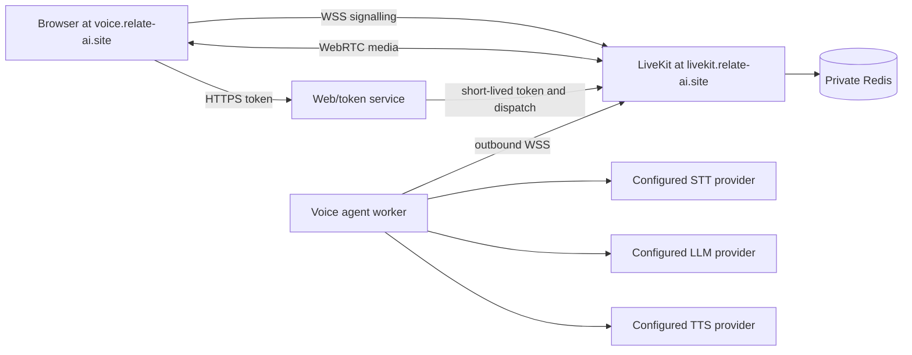

# LiveKit Voice Stack Design

## Approval Basis

The user supplied a frozen execution contract with no unresolved material ambiguity and explicitly authorised autonomous implementation. That contract is the design approval for this execution.

## Requirements

- Self-host LiveKit on the existing Contabo VPS under Coolify lifecycle control.
- Serve LiveKit at `livekit.relate-ai.site` and the browser UI at `voice.relate-ai.site`.
- Use Deepgram for streaming STT and TTS.
- Use only this ordered OpenRouter chain: `poolside/laguna-xs-2.1:free`, `z-ai/glm-5.2:free`, `cohere/north-mini-code:free`.
- Keep provider selection, models, voice, endpoints, timeouts, turn handling, UI, and observability schema-validated and configuration-driven.
- Begin continuous conversation with one Start action, use automatic endpointing, and permit speech barge-in.
- Keep all secrets server-side in Coolify environment storage and mint short-lived LiveKit room tokens.
- Preserve unrelated services, record rollback before mutation, and validate the final deployed state after restart.

## Options Considered

1. One Coolify Compose service containing LiveKit, Redis, worker, and web/token service. This minimises lifecycle and network coupling while retaining separate containers. Recommended.
2. Separate Coolify resources for core, worker, and UI. This improves independent scaling but adds cross-resource networking, secret duplication, and deployment ordering.
3. Single application container embedding signalling, agent, and UI. Rejected because LiveKit and Redis lifecycle concerns would be coupled and provider/worker failures could affect media transport.

## Architecture

Coolify manages one Docker Compose service. Traefik terminates HTTPS independently for the `livekit` and `web` containers. LiveKit publishes only ICE/TCP and UDP-mux media ports directly on the host; Redis and worker health remain private. UDP mux is preferred over a 10,001-port range because this is a single-node deployment and it has a materially smaller collision and firewall blast radius.

## Components

- `livekit`: pinned official server image, WSS/API behind Coolify, direct `7881/tcp` and `7882/udp` media. Embedded TURN is explicitly disabled for this MVP so no implicit relay range is exposed; ICE/TCP remains the restrictive-network fallback.
- `redis`: pinned image, password protected, internal network only, persistent append-only storage.
- `agent`: Python LiveKit Agents worker with a schema-loaded dependency injection registry.
- `web`: FastAPI token/dispatch API plus a minimal static browser interface using the LiveKit client SDK.
- `config/voice-agent.yaml`: independent `stt`, `tts`, `llm`, `fallback`, `turn_handling`, `agent`, `ui`, and `observability` sections.

`STTProvider`, `TTSProvider`, and `LLMProvider` protocols are implemented by Deepgram/OpenRouter adapters. Core session assembly consumes interface-compatible configured instances and contains no provider selection branches. Mock adapters prove that providers can be extended without editing orchestration.

## Data Flow

Start requests a server-minted token and room assignment, joins LiveKit, enables the microphone, and updates browser state from participant/audio events. The worker receives microphone audio, streams it to configured STT, sends final text to the configured LLM chain, streams reply text to configured TTS, and publishes audio to the room. LiveKit Agents VAD/turn primitives detect speech, endpoint turns, and interrupt current synthesis when the user speaks.

Fallback advances only for availability, rate limiting, timeout, or transient upstream errors. Authentication, invalid-request, configuration, and code errors stop immediately. Runtime logs record only model slug, error category, timing, and request correlation ID.

## Security

Trust boundaries are the public token endpoint, browser media permissions, provider APIs, and LLM output. Controls are strict request schemas, generated room/participant identities, short token TTL, rate limiting, same-origin CORS, CSP and related headers, bounded body size, no browser secrets, no HTML rendering of model output, provider timeouts, and secret-redacted logging. The token endpoint intentionally grants only room join/publish/subscribe for its generated room.

## Validation

Tests cover schema rejection, allowlist/order, fallback categories, provider registry/mock injection, token claims, API limits, frontend Start/End state, Compose security, and secret scans. Release validation additionally uses real Deepgram known audio, real OpenRouter model metadata, a real LiveKit SDK join/media exchange, three automatic turns, overlapping-audio barge-in, browser Start, neighbouring-resource comparison, and a Coolify restart followed by critical retests.

## Failure And Rollback

No existing resource is edited. A new service and two DNS records are additive. On failure, preserve logs/evidence, stop or delete only the new service, and remove only DNS records whose IDs were created by this execution. Never modify unrelated ports, routes, volumes, or applications. TURN/TLS can be added later only with a dedicated hostname and current collision/firewall evidence.
